# 数字图像处理

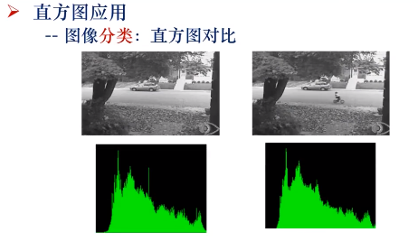

显示单幅图像：

显示多幅图像

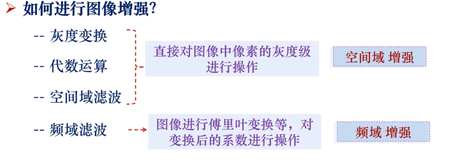

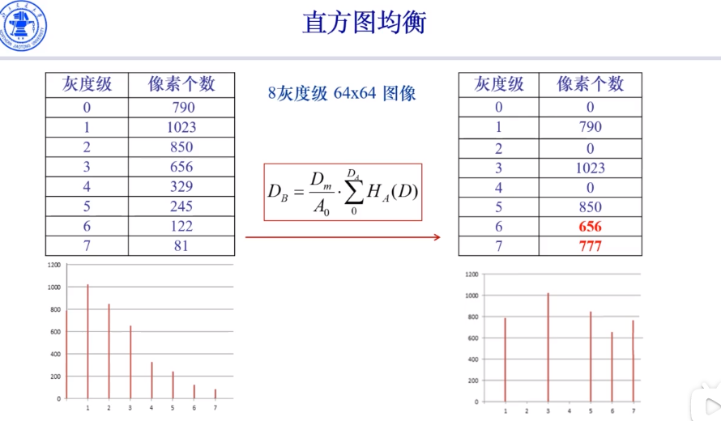

\*: 卷积

高通滤波器器：做微分运算，在离散数据中也就是差分运算

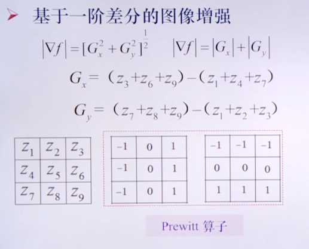

基于二阶差分的图像增强

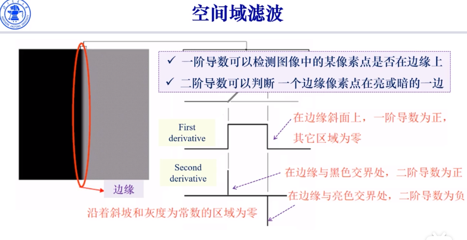

上面的是空间域增强，下面的是频域增强

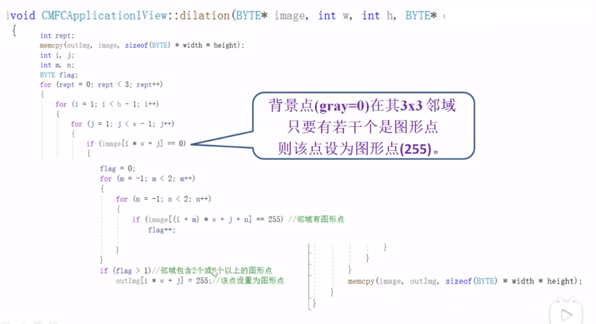

# GAMES203笔记

（有些是看其它视频的截图和记录）

截自《三维重建第一课：三维重建技术介绍及学习路径》

优化弄好的话，研究就会很不错——黄其兴

homework：大作业的形式

- 密度重建

- 基元抽取

- 大作业（有选题）

  - 基于图像的网络图片建模
  - 三维理解
  - 针对3D表现的神经网络
  - 几何理解
  - Reconstruction from hibrid sensor
  - 机器人三维视觉
  - 结构恢复

  不变：

  Geometry，Simulation

## Scanning

structured-light rangefinder

 real-time alignment algorithm

voxel-based merging algorithm

splat-based renderer

结构光测距仪

实时定位算法

分布融合算法

splat-based渲染器

scanning：知道一些基础的东西就好

多视角点云合并为几何数据

# 异构计算

## Portability and Scalability

### Scalability

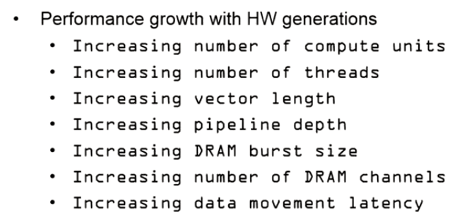

### Portability

## CUDA

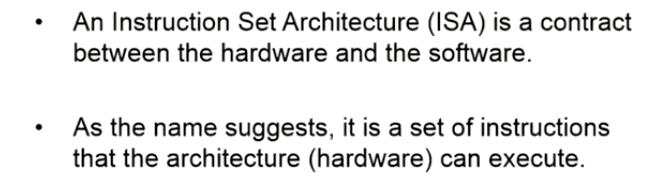

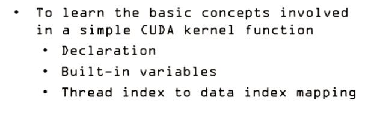

 

# 神经网络与深度学习

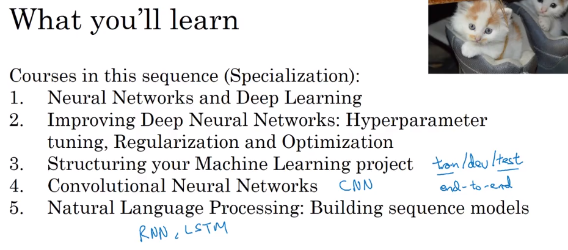

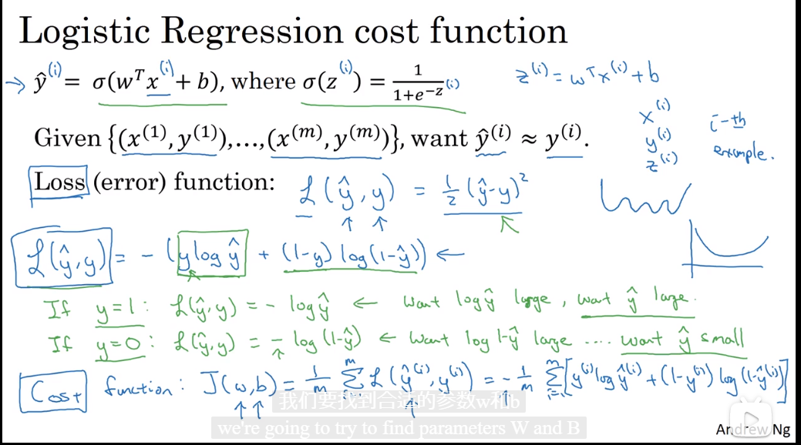

# 数字几何处理

## 这是研究生课程哦

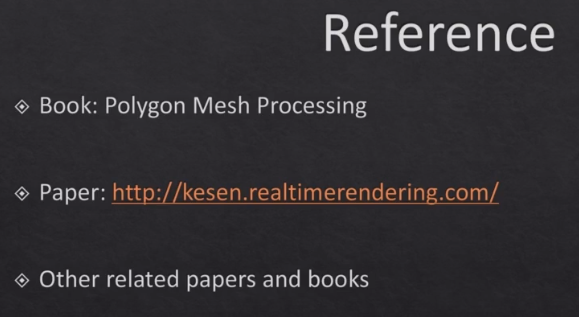

## 三维数据的表达——Representation

PointNet，PointNet++,是两种神经网络，都是作用在点云上的

TSDF：图中距离大于1时全部记为1，小于-1时全部记为-1.在曲面重建（mesh/surface reconstruction）中会经常有用途。

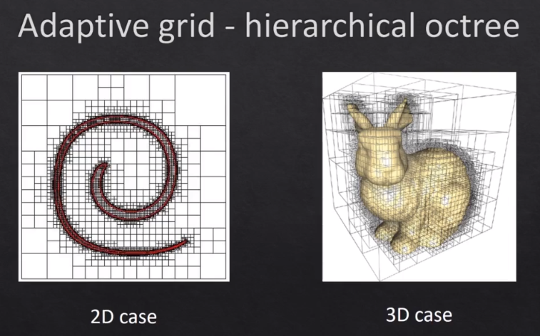

（自适应的方法（八叉树）在blender的动态拓扑里似乎用到了）

# 脑机接口SCCN课程

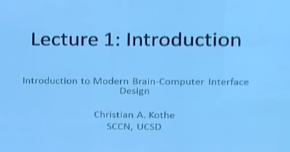

# GAMES101源码分析与学习

std::random_device

标准库提供了一个**非确定性随机数**生成设备.在Linux的实现中,是读取/dev/urandom设备;Windows的实现居然是用rand_s,在这里强烈谴责一下.

　　random_device提供()操作符,用来返回一个min()到max()之间的一个数字.如果是Linux(Unix Like或者Unix)下,都可以使用这个来产生高质量的随机数,可以理解为**真随机数**.

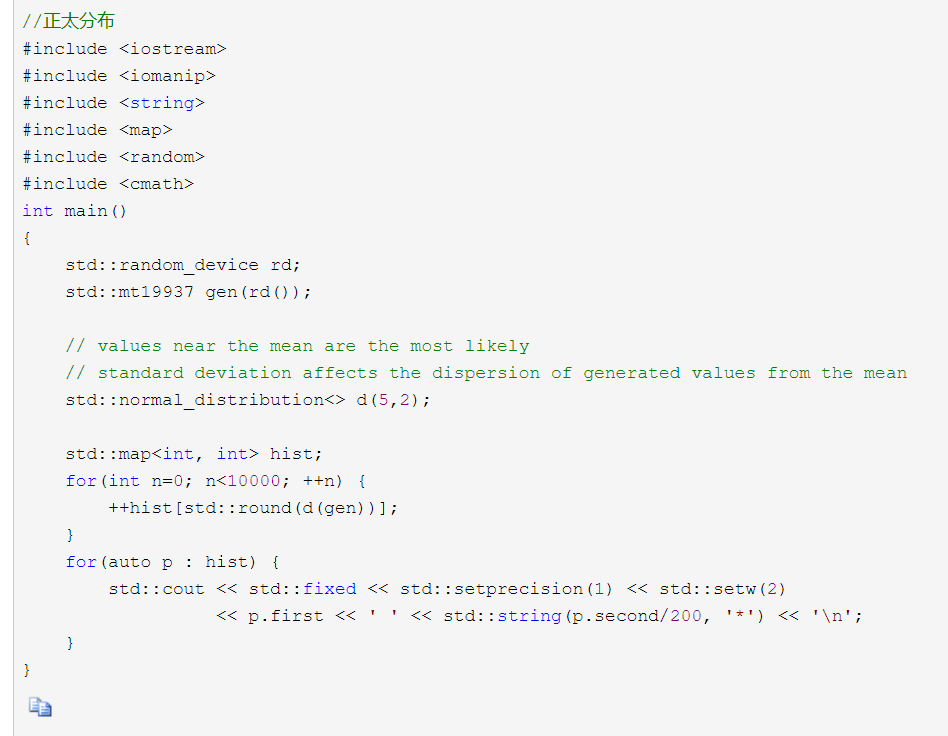

clamp：

解二次方程：

make_unique:智能指针

std::move

一个常用的函数：

计算反射方向：

Object：

- ior ：折射系数
- Kd：漫射常量
- Ks：反射常量
- diffuseColor：漫射颜色
- specularExponent：反射指数

refract 折射（根据斯涅耳效应Snell's law）

计算菲涅尔效应

求交：

std::optional see https://zhuanlan.zhihu.com/p/64985296

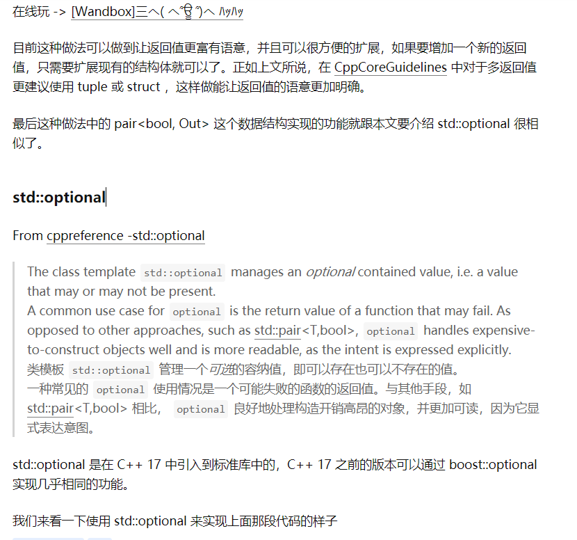

光线的发出：

渲染：

# Cmake

# 数值计算方法

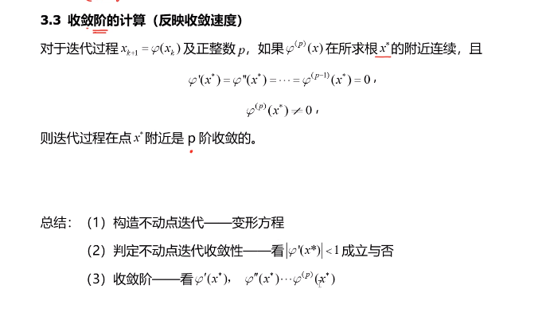

# Limitless

> My favorite superheroes growing up were the X-Men, not because they were the strongest, but because they were misunderstood and weirdly different. I felt I could relate to them. They were mutants, they didn’t fit into society, and people who didn’t understand them shunned them. That was me, minus the superpowers. The X-Men were outcasts, and so was I. I belonged in their world.
>
> I grew up in Westchester County, a suburb of New York City, and I was super-excited one night to discover that, according to the comic books, Professor Xavier’s School for Gifted Youngsters was located near me. When I was nine years old, I would get on my bike nearly every weekend to ride around my neighborhood looking for the school. I was obsessed. I thought, if only I could locate it, I would find in that school a place where I finally fit in, a place where it was safe to be different, a place where I could discover and develop my own superpowers.

> Often when you put a label on someone or something, you create a limit—the label becomes the limitation. 

> when you are the broken one, you don’t feel like you have much to offer.

# End